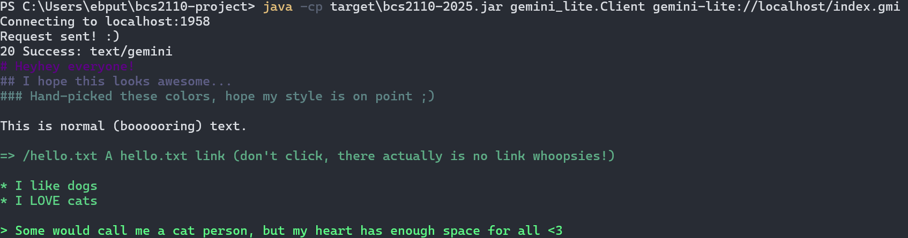
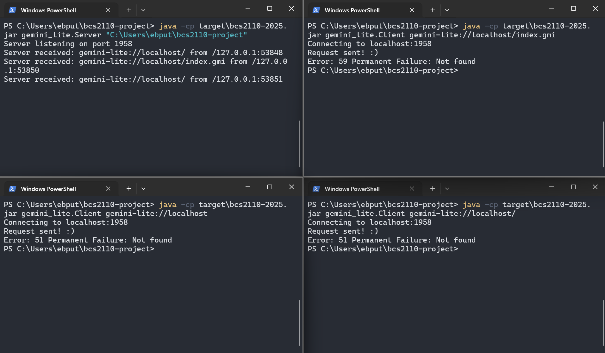
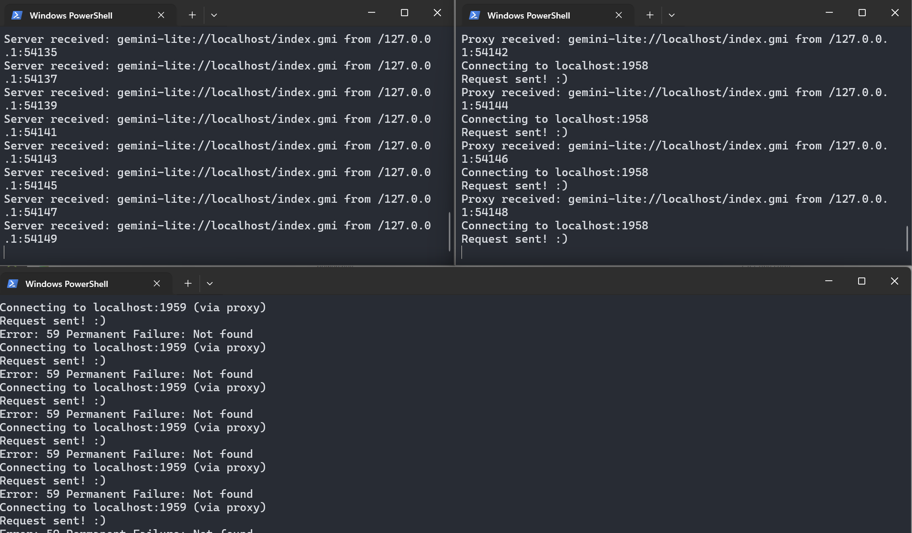
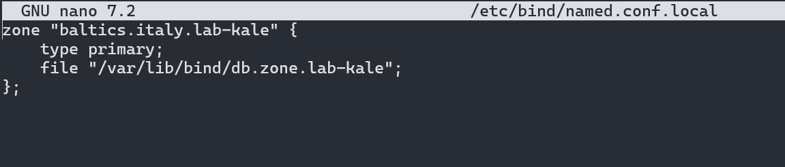
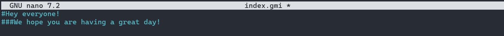

# Project Report

Author: Elizabete Beate Putnina  
Email: e.putnina@student.maastrichtuniversity.nl  
Student ID number: I6407289  

## Gemini Lite Client Program
### Build and run the Client
```powershell
mvn clean package
java -cp target/bcs2110-2025.jar gemini_lite.Client <URL> [input]
```
### How my client handles “slow down” replies
When my client receives status code 44 (slow down), it extracts the number of seconds in the meta field, waits for that duration, and then automatically retries the same URI. To avoid infinite
loops, I have a counter that allows max 5 attempts before exiting with status code 44. If there is no valid meta field with the number for seconds, the client treats this as an invalid slow-down response and also exits with code 44.
### How my client handles input requests (1x)
When the server replies with a 1x Input expected, my client checks whether an input string was provided on the command line.  
If yes, use that input automatically.  
If not, it interacts with the user:  
* For code 10, it reads normal text using console.readLine().  
* For code 11, it reads sensitive input using console.readPassword().

After the input is collected, the client appends it as a query component to the current URI. The request is then resent using this updated URI.
### How my client deals with buggy/hostile server
My client treats any malformed or unexpected server response as a local error. If the server sends an invalid status line, a non-numeric status code, missing header line termination, the parsing code throws a ProtocolSyntaxException or IOException. In all such cases, the client prints an error message to stderr and exits with status code 1.


### Bonus enhancements
#### Gemtext colors
I added a Gemtext colorful renderer that detects the MIME type text/gemini and prints it with ANSI colours (hand-picked by me the designer, I should start a designer career). Headings (#, ##, ###) are shown in a purple/dark green theme, list items (*) are green, and hyperlinks (=>) are shown in a bit darker green. Quotes (>) are bright green) All colouring is applied only for Gemtext; 
other MIME types (e.g., text/plain) are printed normally.  
Here's an example:  

## Gemini Lite Server Program
### Build and run the Server
```powershell
mvn clean package
java -cp target/bcs2110-2025.jar gemini_lite.Server <directory> [port]
```
### How my server handles requests for a URL that corresponds to a directory rather than a file
When the server receives a request whose resolved path points to a directory, it does not directly return the directory.
It simply checks whether the directory contains an index.gmi file. If index.gmi exists and is readable, the server serves it with MIME type text/gemini.
If no index.gmi exists, the server returns a 51 Not found reply.

### Request latencies
To measure p50 and p99 latencies, I executed 100 consecutive requests for each file size using PowerShell’s Measure-Command cmdlet. The created files were afterwards deleted.
Here are the results I got:

|           File size | p50 | p99 |
|--------------------:| --- | --- |
|        **64 bytes** | 285.5201 ms | 322.6598 ms |
|      **1024 bytes** | 285.9006 ms |  334.5414 ms |
|    **131072 bytes** | 285.6199 ms | 441.8928 ms |
| **104857600 bytes** | 9993.0124 ms | 25394.2674 ms |
### Throughput for the 100 MB file
To estimate server throughput, I divided the file size (104,857,600 bytes) by the measured transfer time.  
Using the median (p50) latency for the 100 MB file:  
`Throughput= 104,857,600 bytes / 9.9930124 seconds ≈ 10,500,000 bytes/second ≈ 10.5 MB/s `  
Using the p99 latency for the same file:  
`Throughput= 104,857,600 bytes / 25.3942674 seconds ≈ 4,130,000 bytes/second ≈ 4.1 MB/s`  

### Bonus enhancements
#### Concurrent server
My Gemini Lite server supports multiple simultaneous client requests by using a fixed-size thread pool:  
`Executors.newFixedThreadPool(32)`  
If anything goes wrong, it returns clear error messages if something goes wrong, without stopping the rest of the server.  
To verify that my server handles multiple simultaneous requests, I opened three separate terminal windows and launched the client in all of them at the same time.  


## Gemini Lite Proxy Program
### Build and run the Proxy
```powershell
mvn clean package
java -cp target/bcs2110-2025.jar gemini_lite.Proxy <port>
```
### How to use the Proxy with the Client
```powershell
$env:GEMINI_LITE_PROXY="localhost:1959"
java -cp target/bcs2110-2025.jar gemini_lite.Client <URL> [input]
```
### Situations which provoke reply code 43
My proxy uses a ProxyRequestHandler, which forwards the incoming request to the origin server using ClientEngine.   
The proxy generates status code 43 in the following situations:  
#### Invalid redirect target
Because the server gave a redirect that could not be turned into a valid URI.
#### Cannot reach upstream server
Fails to reach the origin server for different reasons, such as timeout, DNS failures, no route to host, etc.
#### Upstream server sends malformed or unparsable data
If the upstream server sends an invalid Gemini-Lite response (invalid status code, missing CRLF, truncated header, etc.), ClientEngine throws a parsing exception.
The proxy catches the exception and returns 43 Proxy error: <message>.

### Bonus enhancements
#### Concurrent proxy
My proxy also uses the same multithreaded server design as mentioned above.  
`Executors.newFixedThreadPool(32)`  
And the same way as my server does, if there's an error, it prints out an error message but does not stop the whole process - failing gracefully.  
To test whether my proxy supports multiple simultaneous requests, I ran the origin server on port 1958, the proxy on port 1959, and started 20 parallel Client instances with GEMINI_LITE_PROXY=localhost:1959.


# Alternative DNS, Bakeoff and Wireshark outputs
### A trace of iterative DNS resolution of a domain in our local DNS tree
#### Root Server
pi0021@pi0021:~ $ dig -t any baltics.italy.lab-kale  

; <<>> DiG 9.18.41-1~deb12u1-Debian <<>> -t any baltics.italy.lab-kale  
;; global options: +cmd  
;; Got answer:  
;; ->>HEADER<<- opcode: QUERY, status: NOERROR, id: 25924  
;; flags: qr rd ra; QUERY: 1, ANSWER: 2, AUTHORITY: 0, ADDITIONAL: 1  

;; OPT PSEUDOSECTION:  
; EDNS: version: 0, flags:; udp: 1232  
; COOKIE: 58c20803c3d6a66501000000691efc0ed7e85798b786279c (good)  
;; QUESTION SECTION:  
;baltics.italy.lab-kale.		IN	ANY  

;; ANSWER SECTION:  
baltics.italy.lab-kale.	10	IN	SOA	ns1.baltics.italy.lab-kale. hostmaster.baltics.italy.lab-kale. 1 10 10 10 10  
baltics.italy.lab-kale.	10	IN	NS	ns1.baltics.italy.lab-kale.  

;; Query time: 107 msec  
;; SERVER: 10.1.0.1#53(10.1.0.1) (TCP)  
;; WHEN: Thu Nov 20 12:31:26 CET 2025  
;; MSG SIZE  rcvd: 144  
#### Searching further
pi0021@pi0021:~ $ dig @10.1.0.100 baltics.italy.lab-kale  

; <<>> DiG 9.18.41-1~deb12u1-Debian <<>> @10.1.0.100 baltics.italy.lab-kale  
; (1 server found)  
;; global options: +cmd  
;; Got answer:  
;; ->>HEADER<<- opcode: QUERY, status: NOERROR, id: 44668  
;; flags: qr rd; QUERY: 1, ANSWER: 0, AUTHORITY: 1, ADDITIONAL: 2  
;; WARNING: recursion requested but not available  

;; OPT PSEUDOSECTION:  
; EDNS: version: 0, flags:; udp: 1232  
; COOKIE: f24b7fe15f6076a801000000691efcde5d36a2d8ff8b8a65 (good)  
;; QUESTION SECTION:  
;baltics.italy.lab-kale.		IN	A  

;; AUTHORITY SECTION:  
italy.lab-kale.		10	IN	NS	ns1.italy.lab-kale.  

;; ADDITIONAL SECTION:  
ns1.italy.lab-kale.	10	IN	A	10.1.0.101  

;; Query time: 983 msec  
;; SERVER: 10.1.0.100#53(10.1.0.100) (UDP)  
;; WHEN: Thu Nov 20 12:34:55 CET 2025  
;; MSG SIZE  rcvd: 113  

#### Searching even further
pi0021@pi0021:~ $ dig @10.1.0.101 baltics.italy.lab-kale  

; <<>> DiG 9.18.41-1~deb12u1-Debian <<>> @10.1.0.101 baltics.italy.lab-kale  
; (1 server found)  
;; global options: +cmd  
;; Got answer:  
;; ->>HEADER<<- opcode: QUERY, status: NOERROR, id: 382  
;; flags: qr rd; QUERY: 1, ANSWER: 0, AUTHORITY: 1, ADDITIONAL: 2  
;; WARNING: recursion requested but not available  

;; OPT PSEUDOSECTION:  
; EDNS: version: 0, flags:; udp: 1232  
; COOKIE: 4a1af06daa685d5b01000000691efd0dc9ac328c41c08da0 (good)  
;; QUESTION SECTION:  
;baltics.italy.lab-kale.		IN	A  

;; AUTHORITY SECTION:  
baltics.italy.lab-kale.	10	IN	NS	ns1.baltics.italy.lab-kale.  

;; ADDITIONAL SECTION:  
ns1.baltics.italy.lab-kale. 10	IN	A	10.1.0.120  

;; Query time: 23 msec  
;; SERVER: 10.1.0.101#53(10.1.0.101) (UDP)  
;; WHEN: Thu Nov 20 12:35:41 CET 2025  
;; MSG SIZE  rcvd: 113  

#### Finally...
pi0021@pi0021:~ $ dig -t any baltics.italy.lab-kale  

; <<>> DiG 9.18.41-1~deb12u1-Debian <<>> -t any baltics.italy.lab-kale  
;; global options: +cmd  
;; Got answer:  
;; ->>HEADER<<- opcode: QUERY, status: NOERROR, id: 25924  
;; flags: qr rd ra; QUERY: 1, ANSWER: 2, AUTHORITY: 0, ADDITIONAL: 1  

;; OPT PSEUDOSECTION:  
; EDNS: version: 0, flags:; udp: 1232  
; COOKIE: 58c20803c3d6a66501000000691efc0ed7e85798b786279c (good)  
;; QUESTION SECTION:  
;baltics.italy.lab-kale.		IN	ANY  

;; ANSWER SECTION:  
baltics.italy.lab-kale.	10	IN	SOA	ns1.baltics.italy.lab-kale. hostmaster.baltics.italy.lab-kale. 1 10 10 10 10  
baltics.italy.lab-kale.	10	IN	NS	ns1.baltics.italy.lab-kale.  

;; Query time: 107 msec  
;; SERVER: 10.1.0.1#53(10.1.0.1) (TCP)  
;; WHEN: Thu Nov 20 12:31:26 CET 2025  
;; MSG SIZE  rcvd: 144  


### Our modified /var/lib/bind/db.zone.lab-kale

### Our modified /etc/bind/named.conf.local

### An index.gmi we wrote to serve others

### An index.gmi we retrieved from someone else's server
We got the index.gmi a group with pi number 0087. The contents were like this:  
"Hello Gemini!"
Request was "java -cp target/bcs2110-2025.jar gemini_lite.Client gemini-lite://anna.whaleshark.cutie.lab-kale/index.gmi"
## Lab 5: Packet capture of joining a network

What are the source and destination ethernet addresses for the request packet? **src: Intel_e8:12:55 (dc:21:48:e8:12:55), Dst: Broadcast (ff:ff:ff:ff:ff:ff)**

What are the IP source and destination addresses in the request packet? **Src: 0.0.0.0, Dst: 255.255.255.255**

What are the UDP source and destination port numbers in the request packet? **Src Port: 68, Dst Port: 67**

What is the value of the DHCP “Your (client) IP address” field in the request packet? **Your (client) IP address: 0.0.0.0**

Does the request contain an Option 50 (Requested IP Address)? If so, what is the IP address being requested? **Option: (50) Requested IP Address (10.1.1.242)**

What are the source and destination ethernet addresses for the ACK packet? **Src: RaspberryPi_32:7f:c4 (2c:cf:67:32:7f:c4), Dst: Intel_f2:93:60 (a0:b3:39:f2:93:60)**

What are the IP source and destination addresses in the ACK packet? **Src: 10.1.0.1, Dst: 10.1.1.45**

What are the UDP source and destination port numbers in the ACK packet? **Src Port: 67, Dst Port: 68**

What is the value of the DHCP “Your (client) IP address” field in the ACK packet? **Your (client) IP address: 10.1.1.45**

What are the values of the following DHCP options in the ACK packet?

Option (1) Subnet Mask: **Length: 4, Subnet Mask: 255.255.252.0**  
Option (3) Router: **Length: 4, Router: 10.1.0.3**  
Option (6) Domain Name Server: **Length: 4, Domain Name Server: 10.1.0.1**  
#### Look back at Lab 2. Use the appropriate command (ip route, netstat -rn, or route print) to print out your laptop’s forwarding table. Satisfy yourself you can find the Subnet Mask and Router from the DHCP ACK packet in your machine’s forwarding table. Copy and paste the table into your report.
The DHCP ACK packet from the lab Pi contained:

Subnet Mask: 255.255.252.0

Router (Gateway): 10.1.0.3

Assigned IP: 10.1.1.45

These are the values that would appear in my forwarding table when connected to the lab network. However, I totally missed this point and my home network forwarding table does not show anything interesting.
## Lab 5: Packet capture of Gemini Lite™ client
#### What was the line you changed in or added to your Pi’s db.zone.lab-kale file defining the A record pointing at your laptop? Copy it into your report.
elizabeth.baltics.italy.lab-kale. IN A 10.1.0.120
### DNS
#### Request:
java -cp target/bcs2110-2025.jar gemini_lite.Client gemini-lite://anna.whaleshark.cutie.lab-kale/index.gmi

#### Matching responses:
15	3.209718	10.1.1.45	10.1.0.1	DNS	90	Standard query 0x9cdc A anna.whaleshark.cutie.lab-kale

20	3.389471	10.1.0.1	10.1.1.45	DNS	106	Standard query response 0x9cdc A anna.whaleshark.cutie.lab-kale A 10.1.0.140

I did not find any ARP connected to my far friend's IP 10.1.0.140.

What is the relative sequence number of the start of this data block? **Seq=1**

What is the raw sequence number of the start of this data block? **Sequence Number (raw): 3411660525**

What will the next relative sequence number be? **Next Sequence Number: 57**

What is its relative acknowledgement number? **Acknowledgment Number: 57**

What is its raw acknowledgement number? **Acknowledgment number (raw): 3411660581**

How do these numbers relate to the numbers from the previous question? **The client's next sequence number is the same as the next packet's server ACK number.** 

### Find the packet(s) conveying the Gemini Lite™ reply data from the server to the client.
#### How many of them are there in your capture?
Find the first packet with the TCP FIN bit set.
I have two packets: packet 26 has the reply line and packet 27 has the body + FIN.

#### Is it a packet from the client or from the server?
It is a packet from the server (as the server uses: 10.1.0.140 and that's the source of this packet).

## Lab 5: Packet capture of Gemini Lite™ server
Because of a malfunction in the server and Wireshark, and running out of lab time, I could not get the correct packets from Wireshark. We asked TA to help us, however we could not figure it out in time. Wireshark eventually stopped recording any 1958 port traffic.
I will answer to the questions below with theory as to what it should be (as best as I can figure it out).

#### What is its calculated window size? 
As far as I know, this should be readable from the TCP header of the request packet. Theoretically it is simply whatever value the client’s operating system advertises as its available receive buffer space.

#### The rwnd field describes how much buffer space is available in some receive buffer. Whose receive buffer is being talked about: the client’s, or the server’s?
I believe the client's receive buffer.
#### Does the sequence number field describe the client-to-server bytes or the server-to-client bytes?
The TCP sequence number always counts the bytes flowing in the direction of the packet. I believe the SEQ number refers to the bytes sent from the client to the server.
#### Does the acknowledgement number field describe the client-to-server bytes or the server-to-client bytes?
The ACK number always acknowledges data flowing in the opposite direction of the packet. I would suppose that the ACK acknowledges the bytes previously sent from the server to the client.
#### How many of them are there in your capture?
The server reply is split into two packets (as similarly to the client part of the REPORT.md):

(1) one packet containing the reply header, 

and

(2) one packet containing the reply body.

My server did not produce these packets during capture, so I could not count them, but theoretically (hopefully) there should be two.

#### When you compare and contrast your two packet capture traces, one for a client and one for a server, what (if any) of that asymmetry do you notice in the on-the-wire packets?
I would assume that the only asymmetry could be that the client always has to initiate the connection. 

#### Is anything substantially different from the on-the-wire perspective about TCP acting as a server and TCP acting as a client? Why do you think this is?
As TCP is a symmetric protocol, I believe nothing too much changes on-the-wire, and "client"-"server" socket is more like an abstraction and I think that also nothing much changes.

## Lab 5: Port Scan
PS C:\Users\ebput\bcs2110-project> nmap -T5 pi0021.kale
Starting Nmap 7.98 ( https://nmap.org ) at 2025-11-27 12:04 +0100
Nmap scan report for pi0021.kale (10.1.0.120)
Host is up (0.022s latency).
Not shown: 998 closed tcp ports (reset)
PORT   STATE SERVICE
22/tcp open  ssh
53/tcp open  domain
MAC Address: 2C:CF:67:32:77:48 (Raspberry Pi (Trading))

Nmap done: 1 IP address (1 host up) scanned in 11.70 seconds

PS C:\Users\ebput\bcs2110-project> nmap -A -T5 pi0021.kale
Starting Nmap 7.98 ( https://nmap.org ) at 2025-11-27 12:05 +0100
Nmap scan report for pi0021.kale (10.1.0.120)
Host is up (0.044s latency).
Not shown: 998 closed tcp ports (reset)
PORT   STATE SERVICE VERSION
22/tcp open  ssh     OpenSSH 9.2p1 Debian 2+deb12u3 (protocol 2.0)
| ssh-hostkey:
|   256 72:43:52:67:78:e0:23:ed:c9:f4:ff:89:fb:4a:91:03 (ECDSA)
|_  256 28:29:a7:73:f7:82:f7:c5:56:1f:0c:8a:c0:ae:23:49 (ED25519)
53/tcp open  domain  ISC BIND 9.18.41-1~deb12u1 (Debian Linux)
| dns-nsid:
|_  bind.version: 9.18.41-1~deb12u1-Debian
MAC Address: 2C:CF:67:32:77:48 (Raspberry Pi (Trading))
Aggressive OS guesses: Linux 2.6.32 (96%), Linux 4.15 (96%), OpenWrt 21.02 (Linux 5.4) (96%), MikroTik RouterOS 7.2 - 7.5 (Linux 5.6.3) (96%), Linux 3.2 - 4.14 (96%), Linux 4.15 - 5.19 (96%), Linux 2.6.32 - 3.10 (96%), Linux 4.19 (96%), Linux 6.0 (96%), Linux 3.4 - 3.10 (95%)
No exact OS matches for host (test conditions non-ideal).
Network Distance: 1 hop
Service Info: OS: Linux; CPE: cpe:/o:linux:linux_kernel

TRACEROUTE
HOP RTT      ADDRESS
1   43.94 ms 10.1.0.120

OS and Service detection performed. Please report any incorrect results at https://nmap.org/submit/ .
Nmap done: 1 IP address (1 host up) scanned in 35.07 seconds
## Reflection on Gemini Lite

### 1. Compare and contrast Gemini Lite’s response codes with HTTP/1.1’s response codes. Why do you think the designer of Gemini chose to depart from the classification scheme used by HTTP?
First of all, I believe that Gemini-Lite was explicitly designed so that a client or server can be written quickly and with little code. Thus, the response codes were simplified.

Gemini uses two-digit status values from 10–69, where the first digit defines one of six groups of status codes: input expected (1x), success (2x), redirection (3x), temporary failure (4x), permanent failure (5x), and client certificates (6x).

HTTP/1.1 uses three-digit status values where the first digit defines five classes: informational (1xx), success (2xx), redirection (3xx), client error (4xx), and server error (5xx). After what I have researched, the two digits (xx) allow the protocol to have more specific status codes. For example, there are 17 different client error codes. This probably makes sense as HTTP/1.1 was used in real applications: the debugging becomes simpler because you know exactly where the problem lies.

What I found interesting is the difference between Gemini’s 1(x) class and HTTP’s 1(xx) class – one requires user input, the latter is optional as the user agent is allowed to ignore unexpected messages. Also, Gemini lumps all failures into “temporary” (4x) and “permanent” (5x) without distinguishing “client vs server error” the way HTTP does.

### 2. Suggest some reasons why implementing a caching proxy is challenging (or even impossible!) given the Gemini Lite specification as it stands. Caching differs from archival (see “bonus enhancements” section for the Proxy program): archival only sends its local copy of a resource if the upstream server is unavailable, while caching uses the local copy (if it is “fresh” enough) even if the upstream server is available.
One of my main reasons would probably be that Gemini Lite responses are just “status + meta + body”, with no standard headers or fields to indicate freshness or expiry time (when is the cached copy still valid?).

The second reason could be that Gemini-Lite has only the GET request with no conditional variant, so a proxy must either always serve stale data or always re-fetch the full resource, which defeats the main benefit of caching.

Third, caching a 1x response would make no sense (you don’t want to replay someone else’s search prompt or answer).

### 3. Is it acceptable, within the specification, for a proxy to simply relay redirections and “slow down” responses that it receives from upstream? Why or why not? Which position should the specification take on this question, in your opinion, and why?
Within the Gemini Lite specification, it is acceptable for a proxy to simply relay redirections (3x status codes) and to “slow down” responses it receives from upstream, as there is nothing said in the protocol about mandating timing or pacing constraints for data transmission. I believe the slowing down should be fine, and it should be allowed as an implementation choice.

### 4. Imagine you are building a graphical browser for Gemtext, with clickable hyperlinks and so on. Imagine you are asked to change the overall system—this could mean any combination of changes to your client program, to gemini-lite servers, or to the gemini-lite or Gemtext protocol specifications themselves—to implement support for inline display of images in a page.
#### Do you need to make changes to the gemini-lite network protocol? If so, which?
#### Do you need to make changes to the Gemtext format? If so, which?
#### Do you need to change the specification for how clients are required to behave? If so, how? Perhaps there’s an alternative interaction style that allows inline display of images while sticking to the letter of the spec?


### 5. Criticise the protocol more generally, in light of the needs of application programs as discussed in class. Does it offer reliable delivery? Does it make efficient use of available bandwidth? Is it precisely-enough specified? How could it be improved?
