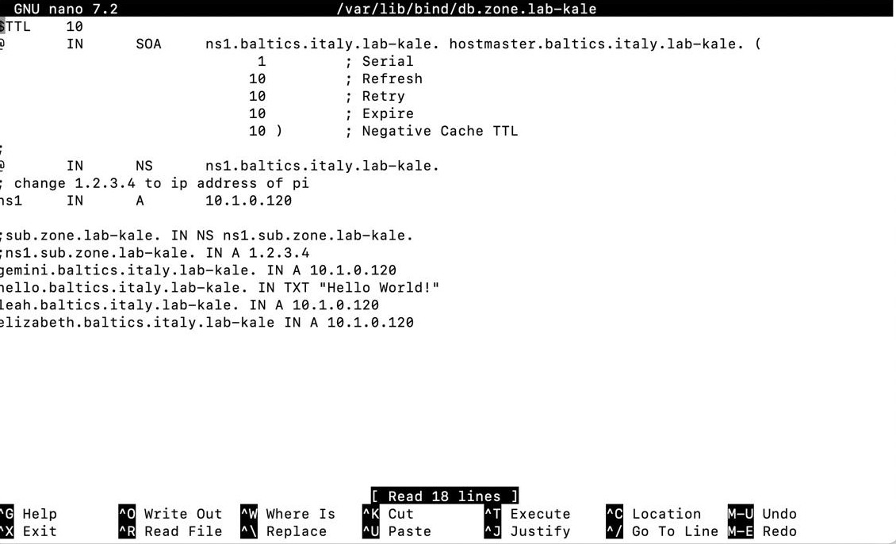

# Project Report

Author: Elizabete Beate Putnina
Email: e.putnina@student.maastrichtuniversity.nl
Student ID number: I6407289

## Gemini Lite Client Program

Document how your program handles “slow down” replies in your report.
Document how your program handles input requests in your report.

PowerShell - run all tests:

```powershell
cd "C:\Users\User\Documents\Computer Networks\bcs2110-project\bcs2110-2025-gemini-lite"
mvn -f .\pom.xml test
```

Run a single test class or method:

```powershell
mvn -f .\pom.xml -Dtest=ReplyTests test
mvn -f .\pom.xml -Dtest=ReplyTests#parseFormatRoundTrip test
```

Build package:

```powershell
mvn -f .\pom.xml package
```

Run the provided minimal server (in one shell):

```powershell
java -cp .\target\classes TerribleServer
java -cp .\target\classes gemini_lite.Server
```

Run the client (in another shell):

```powershell
java -cp .\target\bcs2110-2025.jar gemini_lite.Client gemini-lite://localhost/
```

Note:
- Client default port in source is 1958;


### Bonus enhancements

(If you attempt any bonus enhancements, document them in this section.)

## Gemini Lite Server Program

(Insert user documentation for your program here. Include command-line usage instructions.)
Think about how your program will handle requests for a URL that corresponds to a directory rather than a file. Document this in your report.

### Bonus enhancements

(If you attempt any bonus enhancements, document them in this section.)

## Gemini Lite Proxy Program

(Insert user documentation for your program here. Include command-line usage instructions.)
Certain error situations will result in a special reply code 43, “proxy error”.
Document in your report the situations which provoke reply code 43 in your program.

### Bonus enhancements

(If you attempt any bonus enhancements, document them in this section.)


# Run only Reply tests
```powershell
mvn -f .\pom.xml -Dtest=ReplyTests test
```

# Run only Request tests
```powershell
mvn -f .\pom.xml -Dtest=RequestTests test
```

## Alternative DNS, Bakeoff and Wireshark outputs


### Our modified /var/lib/bind/db.zone.lab-kale

### Our modified /etc/bind/named.conf.local

### An index.gmi we wrote to serve others

### An index.gmi we retrieved from someone else's server

## Lab 5: Packet capture of joining a network
What are the source and destination ethernet addresses for the request packet?

What are the IP source and destination addresses in the request packet?

What are the UDP source and destination port numbers in the request packet?

What is the value of the DHCP “Your (client) IP address” field in the request packet?

Does the request contain an Option 50 (Requested IP Address)? If so, what is the IP address being requested?

What are the source and destination ethernet addresses for the ACK packet?

What are the IP source and destination addresses in the ACK packet?

What are the UDP source and destination port numbers in the ACK packet?

What is the value of the DHCP “Your (client) IP address” field in the ACK packet?

What are the values of the following DHCP options in the ACK packet?

Option (1) Subnet Mask
Option (3) Router
Option (6) Domain Name Server
Look back at Lab 2. Use the appropriate command (ip route, netstat -rn, or route print) to print out your laptop’s forwarding table. Satisfy yourself you can find the Subnet Mask and Router from the DHCP ACK packet in your machine’s forwarding table. Copy and paste the table into your report.

## Reflection on Gemini Lite

### 1. Compare and contrast Gemini Lite’s response codes with HTTP/1.1’s response codes. Why do you think the designer of Gemini chose to depart from the classification scheme used by HTTP?
First of all, I believe that Gemini-Lite was explicitly designed so that a client or server can be written quickly and with little code. Thus, the response codes were simplified.

Gemini uses two-digit status values from 10–69, where the first digit defines one of six groups of status codes: input expected (1x), success (2x), redirection (3x), temporary failure (4x), permanent failure (5x), and client certificates (6x).

HTTP/1.1 uses three-digit status values where the first digit defines five classes: informational (1xx), success (2xx), redirection (3xx), client error (4xx), and server error (5xx). After what I have researched, the two digits (xx) allow the protocol to have more specific status codes. For example, there are 17 different client error codes. This probably makes sense as HTTP/1.1 was used in real applications: the debugging becomes simpler because you know exactly where the problem lies.

What I found interesting is the difference between Gemini’s 1(x) class and HTTP’s 1(xx) class – one requires user input, the latter is optional as the user agent is allowed to ignore unexpected messages. Also, Gemini lumps all failures into “temporary” (4x) and “permanent” (5x) without distinguishing “client vs server error” the way HTTP does.

### 2. Suggest some reasons why implementing a caching proxy is challenging (or even impossible!) given the Gemini Lite specification as it stands. Caching differs from archival (see “bonus enhancements” section for the Proxy program): archival only sends its local copy of a resource if the upstream server is unavailable, while caching uses the local copy (if it is “fresh” enough) even if the upstream server is available.
One of my main reasons would probably be that Gemini Lite responses are just “status + meta + body”, with no standard headers or fields to indicate freshness or expiry time (when is the cached copy still valid?).

The second reason could be that Gemini-Lite has only the GET request with no conditional variant, so a proxy must either always serve stale data or always re-fetch the full resource, which defeats the main benefit of caching.

Third, caching a 1x response would make no sense (you don’t want to replay someone else’s search prompt or answer).

### 3. Is it acceptable, within the specification, for a proxy to simply relay redirections and “slow down” responses that it receives from upstream? Why or why not? Which position should the specification take on this question, in your opinion, and why?
Within the Gemini Lite specification, it is acceptable for a proxy to simply relay redirections (3x status codes) and to “slow down” responses it receives from upstream, as there is nothing said in the protocol about mandating timing or pacing constraints for data transmission. I believe the slowing down should be fine, and it should be allowed as an implementation choice.

### 4. Imagine you are building a graphical browser for Gemtext, with clickable hyperlinks and so on. Imagine you are asked to change the overall system—this could mean any combination of changes to your client program, to gemini-lite servers, or to the gemini-lite or Gemtext protocol specifications themselves—to implement support for inline display of images in a page.
#### Do you need to make changes to the gemini-lite network protocol? If so, which?
#### Do you need to make changes to the Gemtext format? If so, which?
#### Do you need to change the specification for how clients are required to behave? If so, how? Perhaps there’s an alternative interaction style that allows inline display of images while sticking to the letter of the spec?


Criticise the protocol more generally, in light of the needs of application programs as discussed in class. Does it offer reliable delivery? Does it make efficient use of available bandwidth? Is it precisely-enough specified? How could it be improved?
